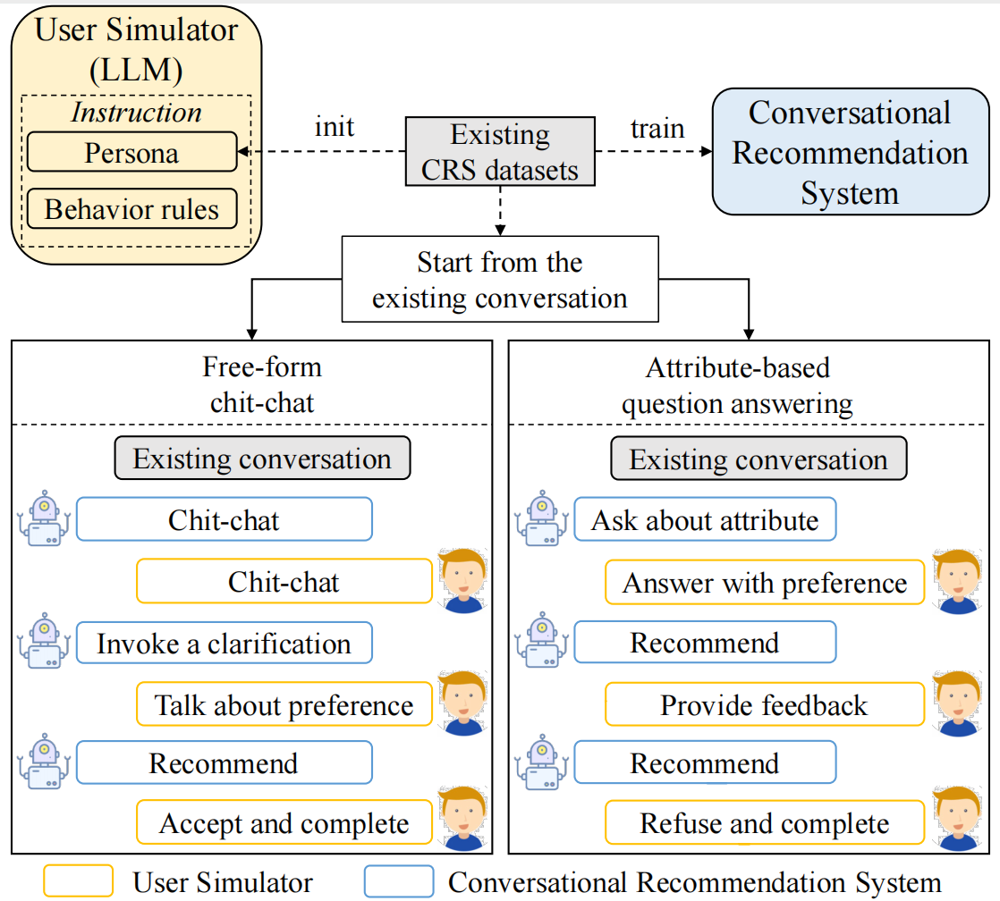

# Rethinking the Evaluation for Conversational Recommendation in the Era of Large Language Models

This repo provides the source code & data of our paper: Rethinking the Evaluation for Conversational Recommendation in the Era of Large Language Models.

## 😀 Overview

**Highlights**:
- 1️⃣ We are the first to examine ChatGPT in conversational recommendation systematically, the ability of which is **underestimated** in traditional evaluation approach.
- 💡 We propose a new interactive approach that employs LLM-based user simulators for evaluating CRSs.
- 🔝 The recall@50 metric can be boosted from 0.218 to 0.739 on the redial dataset with our new interactive evaluation approach, even surpassing the currently leading CRS baseline.

we propose an **i**nteractive **Eval**uation approach based on **LLM**s named **iEvaLM** that harnesses LLM-based user simulators. We take the ground-truth items from the example as the user preference through the interaction, and use them to set up the persona of the simulated users by LLMs through instructions. To further make a comprehensive evaluation, we consider two types of interaction: *attribute-based question answering* and *free-form chit-chat*.

<p align="center">
  
</p>


## 🚀 Quick Start

### Requirements

- python == 3.9.16
- pytorch == 1.13.1
- transformers == 4.28.1
- pyg == 2.3.0
- accelerate == 0.18.0

### Download Models

You can download our fine-tuned models from the [link](https://drive.google.com/drive/folders/1h2AcRn3cd9qXToM9hFAXFV5evXJM-wyD?usp=sharing), which include recommendation and conversation models of **KBRD**, **BARCOR** and **UniCRS**. Please put the downloaded model into src/utils/model directory.

### Interact with the user simulator

- dataset: [redial, opendialkg]
- mode: [ask, chat]
- model: [kbrd, barcor, unicrs, chatgpt]

```bash
cd script
bash {dataset}/cache_item.sh 
bash {dataset}/{mode}_{model}.sh 
```

You can customize your iEvaLM-CRS by specifying these configs:
- `--api_key`: your API key
- `--turn_num`: number of conversation turns. We employ five-round interaction in iEvaLM-CRS.

After the execution, you will find detailed interaction information under "save_{turn_num}/{mode}/{model}/{dataset}/".

### Evaluate

```bash
cd script
bash {dataset}/Rec_eval.sh
```

You can customize your iEvaLM-CRS by specifying these configs:
- `--turn_num`: number of conversation turns.
- `--mode`: [ask, chat]

After the execution, you will find evaluation results under "save_{turn_num}/result/{mode}/{model}/{dataset}.json".


## 🌟 Perfermance
<p align="center">Performance of CRSs and ChatGPT using different evaluation approaches.</p>
<table border="1" align="center">
  <tbody >
  <tr align="center">
    <td colspan="2">Model</td>
    <td colspan="3">KBRD</td>
    <td colspan="3">BARCOR</td>
    <td colspan="3">UniCRS</td>
    <td colspan="3">ChatGPT</td>
  </tr>
  <tr align="center">
    <td colspan="2">Evaluation Approach</td>
    <td>Original</td>
    <td>iEvaLM(attr)</td>
    <td>iEvaLM(free)</td>
    <td>Original</td>
    <td>iEvaLM(attr)</td>
    <td>iEvaLM(free)</td>
    <td>Original</td>
    <td>iEvaLM(attr)</td>
    <td>iEvaLM(free)</td>
    <td>Original</td>
    <td>iEvaLM(attr)</td>
    <td>iEvaLM(free)</td>
  </tr>
  <tr align="center">
    <td rowspan="3">ReDial</td>
    <td>R@1</td>
    <td>0.028</td>
    <td>0.039</td>
    <td>0.035</td>
    <td>0.031</td>
    <td>0.034</td>
    <td>0.034</td>
    <td>0.050</td>
    <td>0.053</td>
    <td>0.107</td>
    <td>0.037</td>
    <td><b>0.191</b></td>
    <td>0.146</td>
  </tr>
  <tr align="center">
    <td>R@10</td>
    <td>0.169</td>
    <td>0.196</td>
    <td>0.198</td>
    <td>0.170</td>
    <td>0.201</td>
    <td>0.190</td>
    <td>0.215</td>
    <td>0.238</td>
    <td>0.317</td>
    <td>0.130</td>
    <td><b>0.536</b></td>
    <td>0.440</td>
  </tr>
  <tr align="center">
    <td>R@50</td>
    <td>0.366</td>
    <td>0.436</td>
    <td>0.453</td>
    <td>0.372</td>
    <td>0.427</td>
    <td>0.467</td>
    <td>0.413</td>
    <td>0.520</td>
    <td>0.602</td>
    <td>0.218</td>
    <td><b>0.739</b></td>
    <td>0.705</td>
  </tr>
  <tr align="center">
    <td rowspan="3">OpenDialKG</td>
    <td>R@1</td>
    <td>0.231</td>
    <td>0.131</td>
    <td>0.234</td>
    <td>0.312</td>
    <td>0.264</td>
    <td>0.314</td>
    <td>0.308</td>
    <td>0.180</td>
    <td>0.314</td>
    <td>0.310</td>
    <td>0.299</td>
    <td><b>0.400</b></td>
  </tr>
  <tr align="center">
    <td>R@10</td>
    <td>0.423</td>
    <td>0.293</td>
    <td>0.431</td>
    <td>0.453</td>
    <td>0.423</td>
    <td>0.458</td>
    <td>0.513</td>
    <td>0.393</td>
    <td>0.538</td>
    <td>0.539</td>
    <td>0.604</td>
    <td><b>0.715</b></td>
  </tr>
  <tr align="center">
    <td>R@50</td>
    <td>0.492</td>
    <td>0.377</td>
    <td>0.509</td>
    <td>0.510</td>
    <td>0.482</td>
    <td>0.530</td>
    <td>0.574</td>
    <td>0.458</td>
    <td>0.609</td>
    <td>0.607</td>
    <td>0.708</td>
    <td><b>0.825</b></td>
  </tr>
  </tbody>

</table>


<p align="center">Persuasiveness of explanations generated by CRSs and ChatGPT.</p>
<table border="1" align="center">
  <tbody>
    <tr align="center">
    <td>Model</td>
    <td>Evaluation Approach</td>
    <td>ReDial</td>
    <td>OpenDialKG</td>
  </tr>
    <tr align="center">
    <td rowspan="2">KBRD</td>
    <td>Original</td>
    <td>0.638</td>
    <td>0.824</td>
  </tr>
  </tr>
    <tr align="center">
    <td>iEvaLM</td>
    <td>0.766</td>
    <td>0.912</td>
  </tr>
  </tr>
    <tr align="center">
    <td rowspan="2">BARCOR</td>
    <td>Original</td>
    <td>0.667</td>
    <td>1.149</td>
  </tr>
  </tr>
    <tr align="center">
    <td>iEvaLM</td>
    <td>0.795</td>
    <td>1.224</td>
  </tr>
  </tr>
    <tr align="center">
    <td rowspan="2">UniCRS</td>
    <td>Original</td>
    <td>0.685</td>
    <td>1.128</td>
  </tr>
  </tr>
    <tr align="center">
    <td>iEvaLM</td>
    <td>1.015</td>
    <td>1.321</td>
  </tr>
  </tr>
    <tr align="center">
    <td rowspan="2">ChatGPT</td>
    <td>Original</td>
    <td>0.787</td>
    <td>1.221</td>
  </tr>
  </tr>
    <tr align="center">
    <td>iEvaLM</td>
    <td><b>1.331</b></td>
    <td><b>1.513</b></td>
  </tr>
  </tbody>
</table>
